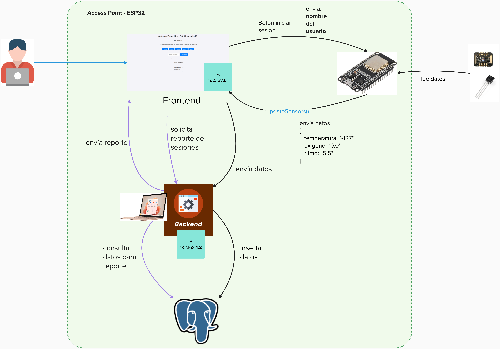

# ProyectoFinal-SE-PanelFBM
## Diagrama del proyecto


## Requisitos
- **Base de datos**: PostgreSQL
    
    [PostgreSQL](https://www.postgresql.org/)

- **Servidor backend**: NodeJS

    [NodeJS](https://nodejs.org/)

    1. Visita el sitio web oficial: [NodeJS](https://nodejs.org/)

    2. Descarga Node.js: Elige la versión que prefieras y descárgala según tu sistema operativo (Windows, macOS, Linux). El sitio web automáticamente debería ofrecerte la mejor opción para tu sistema.

    3. Instala Node.js: Ejecuta el instalador descargado y sigue las instrucciones. El instalador configurará tanto Node.js como **npm** (Node Package Manager), que es el gestor de paquetes por defecto para Node.js, permitiéndote instalar bibliotecas y herramientas de terceros.

- **Arduino IDE**
- **Esp32**
- **Led y sensores**

## Instalacion y funcionamiento
1. **Clonacion del proyecto**

    - Abre una terminal o línea de comandos en tu computadora.

    - Navega al directorio donde deseas clonar el repositorio usando el comando `cd`. Por ejemplo, para cambiar al directorio Documentos, usarías `cd Documentos`.

    - Ejecuta el comando de clonación. Necesitarás la URL del repositorio que deseas clonar. Esta URL la puedes obtener desde la página del repositorio en GitHub, GitLab, Bitbucket, o cualquier otro servicio de hosting de Git que estés utilizando.

    ```
    git clone git@github.com:OctavioR17/ProyectoFinal-SE-PanelFBM.git
    ```

    - O descarga el proyecto como ZIP

        

2. **Crea la tabla en PostgreSQL**

    Dentro de PostgreSQL usa el query del archivo `DDL.sql` en la carpeta `Base de datos` para crear la tabla.

3. **Carga el programa en el Esp32**

    Abre la carpeta `AP` usando Arduino IDE y carga el programa `AP.ino`.

    Ejemplo del circuito:

    

4. **Conecta la laptop al Access Point del Esp32**

5. **Inicia el servidor**

    Para instalar las librerías necesarias y ejecutar un proyecto clonado, sigue estos pasos:

    **Abre una terminal o línea de comandos** en la carpeta **backend**. Esto se puede hacer navegando a la carpeta del proyecto mediante el explorador de archivos de tu sistema operativo y, dependiendo de tu sistema, puedes abrir directamente una terminal en esa ubicación. En Windows, puedes hacer clic derecho mientras mantienes presionada la tecla Shift y seleccionar "Abrir ventana de PowerShell aquí".

    **Instala las dependencias del proyecto**. Los proyectos de Node.js suelen incluir un archivo package.json que especifica las librerías (dependencias) necesarias para el proyecto. Para instalar estas dependencias, ejecuta el siguiente comando en la terminal:

    ```
    npm install
    ```

    Este comando descargará e instalará todas las dependencias listadas en el package.json en una carpeta llamada node_modules dentro de tu proyecto.

    **Ejecuta el proyecto**. Usa el comando:

    ```
    npm start
    ```

6. **Ingresa a la pagina 192.168.1.1 y prueba**
